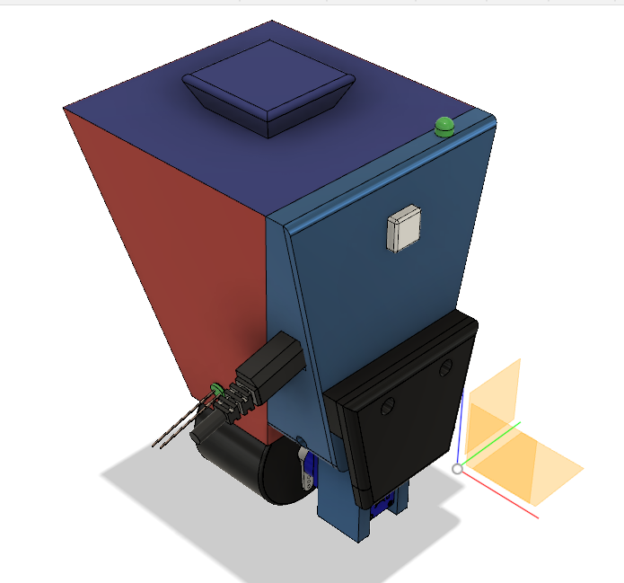
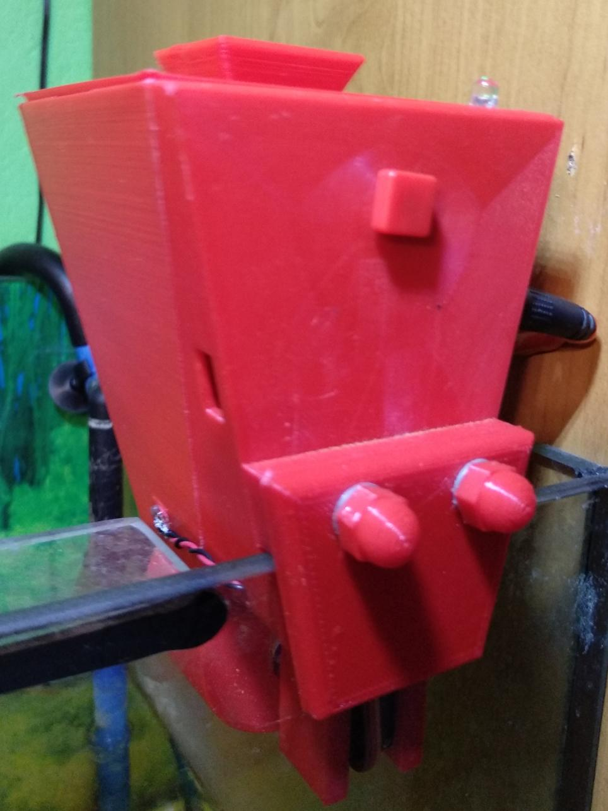
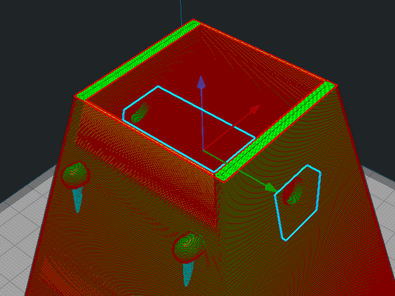
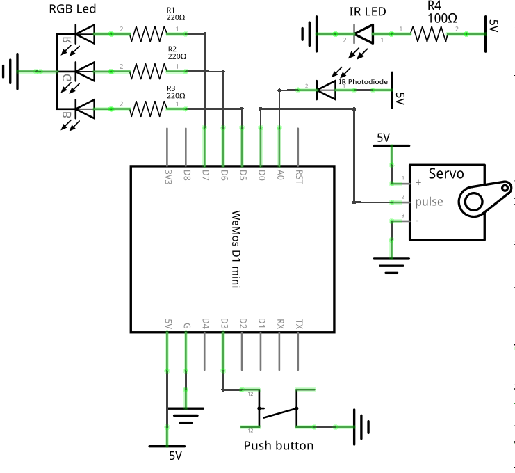
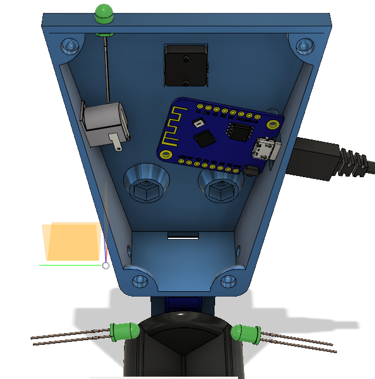
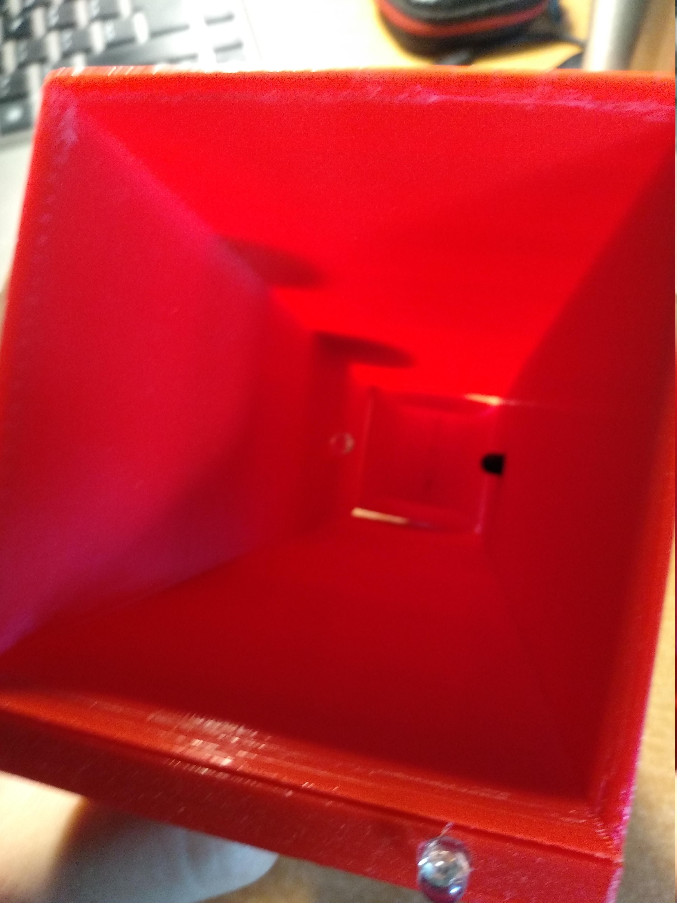

# TurtleFeederInator

Automatic turtle/fish feeder that you can 3D print yourself.
It uses WeMos D1 mini (ESP8266) as main board and features food run out sensor.

It can be powered either from USB or DC Jack (5V).

 

## Getting Started

### Parts
* WeMos D1 mini (the one with mounting holes)
* SG-90 Servo (or similar)
* 12x12 Tactile push button (TC-1212T) and button cap
* Standard 5.5x2.1mm female DC Jack (i took out one from Arduino UNO)
* 5mm Infrared LED (you can take one from old remote)
* 5mm Infrared photodiode
* 5mm RGB LED with common cathode
* 3x 220Ω Resistor
* 100Ω Resistor
* 2x 20mm M5 hex bolt
* 2x M5 washer (DIN 125)
* 2x M5 hex nut 
* 4x small self-tapping screw (two for mount the servo, and two for mount the D1 mini)
* 2x small silicone washer (they often adding them to computer fans for silencing)
* Some wires (ex. from UTP cable)

### Tools needed
* Soldering iron
* Hot glue gun
* Sandpaper
* Cyanoacrylate glue (ex. Super Glue)

### 3D print

Scale `spacer.stl` to the thickness of your aquarium wall (by default it's 5mm thick).
All the parts you can print with standard PLA. 
#### Recommended settings
| Part          | Infill   | Supports  |
| ------------- |:--------:| ---------:|
| `case.stl`    | 30%      | no        |
| `feeder.stl`  | 25%      | yes       |
| `hook.stl`    | 25%      | no        |
| `lid.stl`     | 25%      | optional  |
| `spacer.stl`  | 25%      | no        |
| `funnel.stl`  | 100%     | yes, see bellow|

 
When slicing `funnel.stl` you must block generating supports near IR led and photodiode holes, like on the screenshot below. 

 
To save some time and material, I suggest unticking "Use towers" in support settings when using Cura.

### Assembly

* Print all the parts
* Solder wires to the IR LED and photodiode, about 8-10cm each
* Solder 220Ω resistor to each anode of the RGB diode (longest leg is a cathode)
* Attach the servo to the `case.stl` using silicone washers and two small plastic screws, put the cable inside the case using a hole on the bottom
* Place M5 hex nuts, push button, DC Jack and RGB LED inside desired holes for them
* Secure the button using hot glue
* Put the IR LED and photodiode cables through the side holes of the case.
* Do all the wiring according to schematic bellow 

* Secure RGB LED and DC Jack using hot glue
* Secure WeMos using self-tapping screws
* Attach `spacer.stl` and `hook.stl` to `case.stl` using bolts and washers.
* Check if `funnel.stl` fits the `case.stl`, if not use sandpaper on the joints
* Secure `feeder.stl` to the servo using cyanoacrylate glue
* At this point, everything should look like this 

Yeah, I know it looks quite messy
* Attach carefully `funnel.stl`
* Place the IR LED and photodiode inside their holes (they should hold inside them without any glue)
* Upload firmware using USB cable and load it with turtle/fish food

### Firmware
You can use [this firmware](https://github.com/kacpi2442/TurtleFeederFirmware) or write your own.

Create an issue if you want me to add a link to your firmware here.

## Gallery

## Licence
These files are distributed under the terms of [The MIT License (MIT)](LICENSE)
